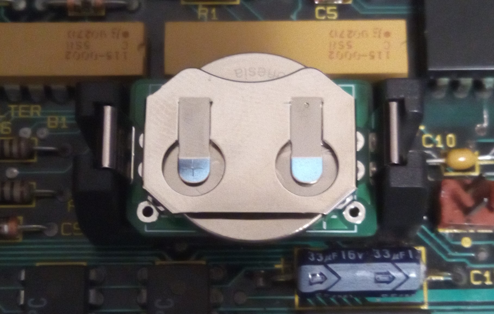

# CR2032 Toaster

This is intended to slot in vertically into a 1/2AA battery holder seen on many Macintosh computers for the PRAM battery. It will allow the use of the less expensive, easier to find and less leaky CR2032 coin batteries.

This is meant to be used laying flat in the battery holder like so:

There's also two extra through holes to solder wires for other uses.

## Bill of Materials

### v1.0 to v1.3

| Quantity | Product Number  | Datasheet                                                    |
| :------- | --------------- | ------------------------------------------------------------ |
| 1        | BAT-HLD-001-THM | [datasheet](datasheets/BAT-HLD-001-THM_Linx_Technologies.pdf) |

### v1.3b

| Quantity | Product Number  | Datasheet                                      |
| :------- | --------------- | ---------------------------------------------- |
| 1        | BAT-HLD-005-THM | [datasheet](datasheets/BAT-HLD-005-THM_TE.pdf) |

## Manufacturing

The release includes the manufacturing files for JLCPCB specifically. If you need to the gerber files, BOM or component pick & place in a different format then you would have to generate them yourself.

The PCB thickness chosen should be at least 1.6mm to provide good contact with the battery holder.

## License

CR2032 Toaster by [Alexandre Marcoux](https://github.com/alxlab-zone66x/cr2032_toaster) licensed under a <a rel="license" href="http://creativecommons.org/licenses/by-nc-sa/4.0/">Creative Commons Attribution-NonCommercial-ShareAlike 4.0 International License</a>.

## Community

For more great retro hardware projects and a great community check out:

Join us in #skunkworks on [Discord](https://discord.gg/GKcvtgU7P9) to help make retro solutions available to all.

