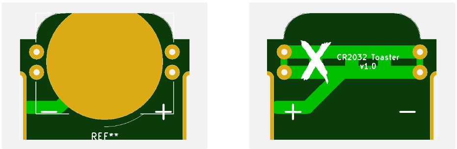

# CR2032 Toaster

This is intended to slot in vertically into a 1/2AA battery holder seen on many Macintosh computers for the PRAM battery. It will allow the use of the less expensive, easier to find and less leaky CR2032 coin batteries.
